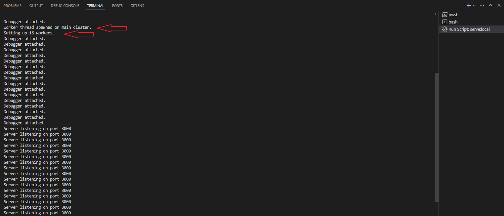
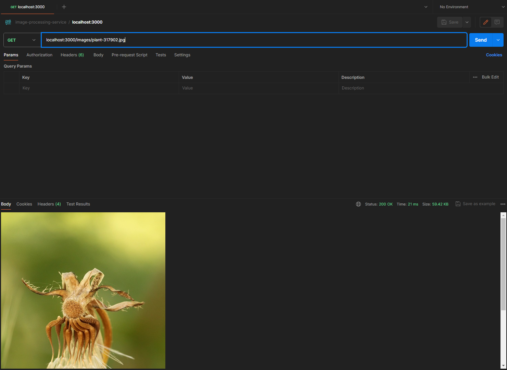
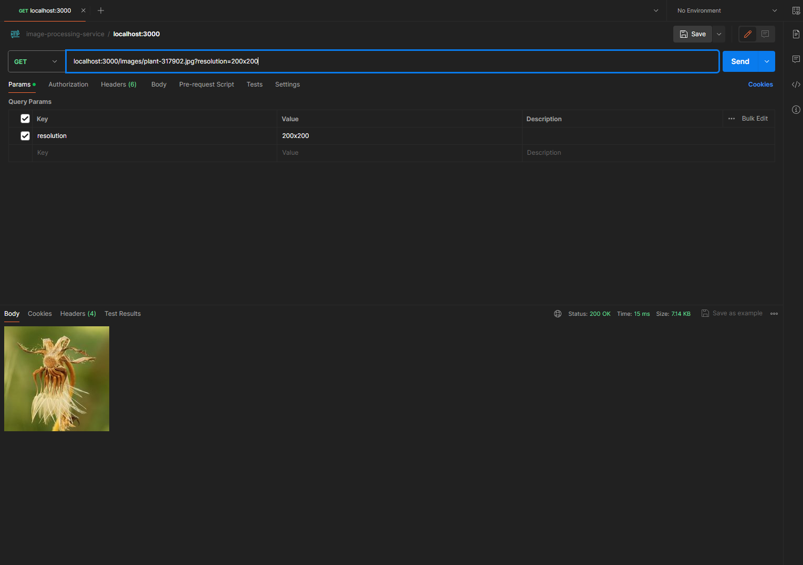
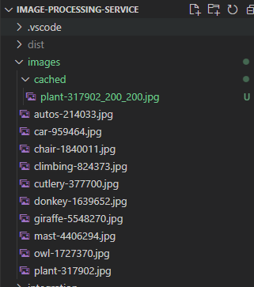
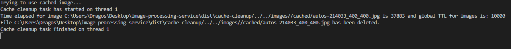

# Image Processing Service

Service for serving images over HTTP and dynamically resize them based on parameters received.

---

## Description

Image processing service is an application that spins up a server using HTTP native nodejs module.
It serves up only images in .jpg format and can also accept query string that specifies resolution of the requested images.
The service dynamically resizes the image if resolution query params has been provided and saves the resized image in the images/cached directory.
This application uses streams to pipe images to the response and cluster native nodejs module to scale horizontally across the available CPUs.
Also there is a worker running on a separate thread on the primary cluster that is scheduled to clean up cached images based on modified date time of the image and a set cache TTL.

## Prerequisites

Follow these instructions to set up and run the image service on your local machine.

### Prerequisites

Node.js installed on your machine (Download Node.js)
Images stored in a directory accessible to the server. (already provided in images directory)

## Installation

    $ git clone https://github.com/DragosAndrei99/image-processing-service
    $ cd image-processing-service
    $ npm install

## Usage

    $ npm run serve:local

The service will start on the configured port (default set to PORT 3000).

### To access images, use the following endpoint:

http://localhost:3000/images/sample.jpg

### To dynamically resize an existing image, use the following endpoint:

http://localhost:3000/images/sample.jpg?resolution=400x400

#### Resolution search params must be integer numbers, bigger than 0 and respect the format: NUMBERxNUMBER

## Available images

autos-214033.jpg \
car-959464.jpg \
chair-1840011.jpg \
climbing-824373.jpg \
cutlery-377700.jpg \
donkey-1639652.jpg \
giraffe-5548270.jpg \
mast-4406294.jpg \
owl-1727370.jpg \
plant-317902.jpg \

## Testing

    $ npm run test:unit
    $ npm run test:integration

### At the moment, this project only supports images with .jpg extension

## Demo:

App is boostrapping , creating a worker thread and clustering 16 processes:

GET localhost:3000/images/plant-317902.jpg call from postman:

GET localhost:3000/images/plant-317902.jpg?resolution=200x200 call from postman:

Image is saved in cache:

Cleanup task starting on thread 1, calculating if image is valid for deletion and deleting it:

